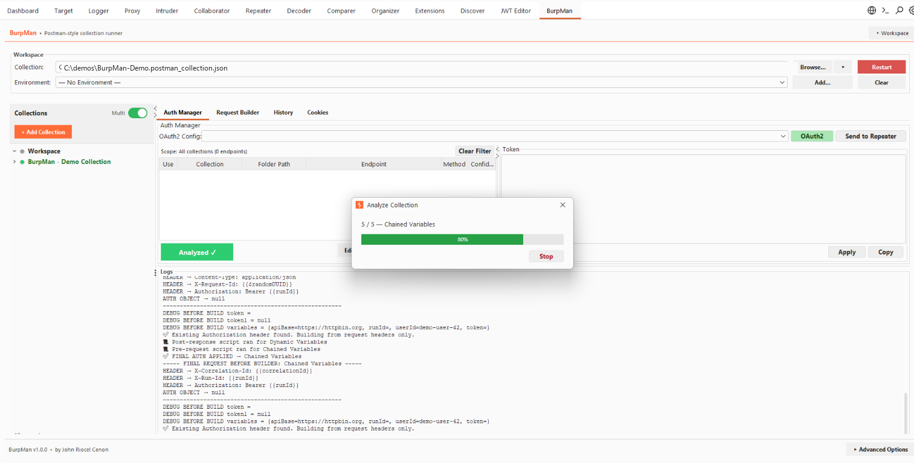
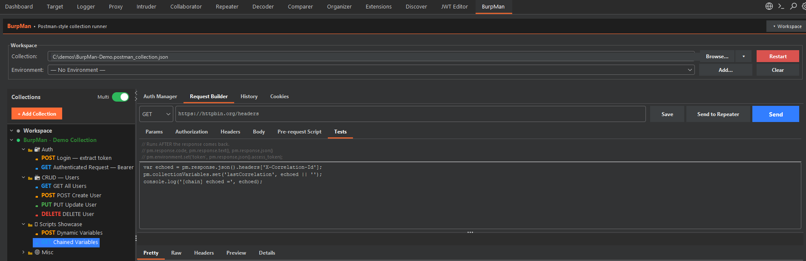
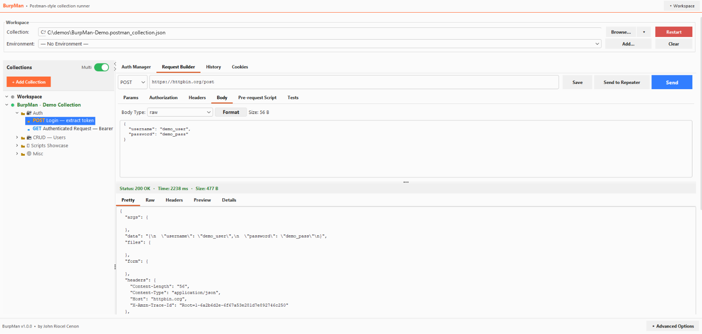
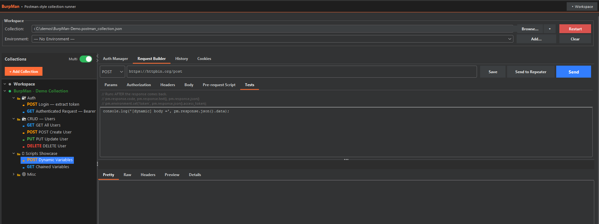
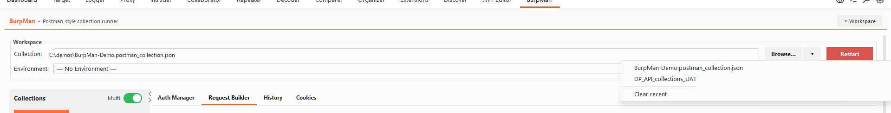
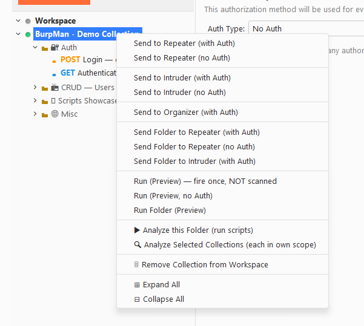
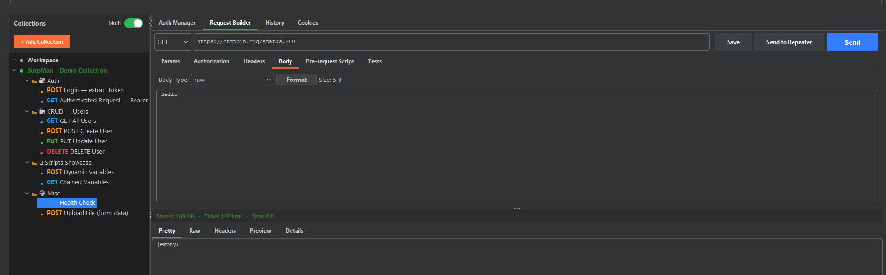
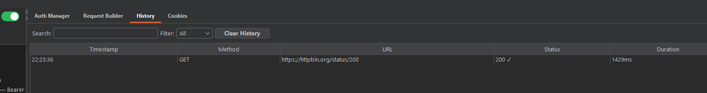
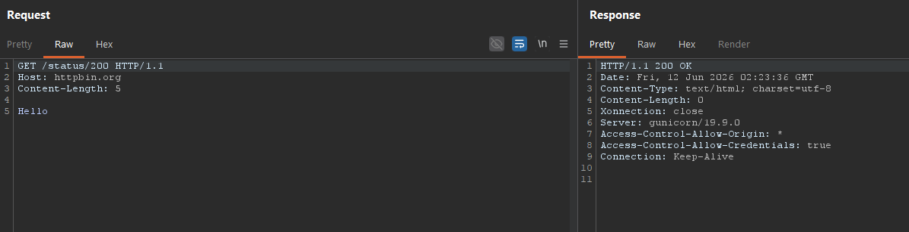

# BurpMan

[](https://portswigger.net/burp)
[](https://www.java.com)
[](https://github.com/JohnRiocelCenon/BurpMan/releases)

A Burp Suite extension that imports **Postman** and **Bruno** API collections, with full variable resolution, pre/post-request script execution, OAuth2/JWT auth management, and a built-in request builder — all without leaving Burp.

If you know Postman, you already know 90% of this tool. The big difference: every request you send also goes through Burp Suite, so you can scan it.

---

## 🚀 Features

- 📁 **Postman Collection v2.0 & v2.1** support
- 🐾 **Bruno collection** support
- 📥 **OpenAPI 3.x / Swagger 2 import** — load any `.json` / `.yaml` spec straight into a collection
- 🔧 **Variable resolution** — environment files, manual entry, smart detection
- 🎲 **80+ dynamic faker variables** — `{{$randomFullName}}`, `{{$randomCity}}`, `{{$randomMacAddress}}`, `{{$randomLoremParagraph}}`, …
- 📝 **Pre/Post-request scripts** — full ES2015+ support with real closures, destructuring, template literals, optional chaining, nullish coalescing — Postman and Bruno scripts run unmodified
- 🔐 **11 auth schemes** — Bearer, Basic, API Key, OAuth2, OAuth 1.0a, AWS Signature v4, Digest, Hawk, Akamai EdgeGrid, ASAP, NTLM
- 🗂️ **Folder-level auth overrides**
- 📊 **Data-driven runs** — feed a CSV or JSON-array file and a folder runs once per row (Postman-style)
- 📋 **Copy as code** — generate snippets in **15 languages / libraries**: curl (bash / cmd), Python (requests / httpx), JavaScript (fetch / axios), Node http, Java (OkHttp / HttpClient5), Go, PowerShell, PHP, Ruby, Rust, C#
- 📜 **Request history** with full response details
- 🍪 **Cookie jar** management with parent-domain replay (SSO-friendly)
- 🌲 **Collection tree** with drag-and-drop reordering
- ⚡ **Auto-run** collections with progress tracking
- 🎨 **Custom UI theme** integrated into Burp Suite

---

## 📋 Requirements

- Burp Suite Professional or Community Edition
- **Java 17+** recommended; Java 11+ works for the lite build
- Burp 2024+ ships with JDK 21 — no extra setup needed
- Maven (to build from source)

---

## 🛠️ Installation

### Option 1: Download Release

1. Download the latest JAR from [Releases](https://github.com/JohnRiocelCenon/BurpMan/releases)
2. In Burp Suite: `Extensions` → `Add` → Select the JAR file
3. The **BurpMan** tab will appear

### Option 2: Build from Source

```bash
git clone https://github.com/JohnRiocelCenon/BurpMan.git
cd BurpMan

# Lite build (~1 MB, minimal deps, regex-based scripts only)
mvn clean package
# → target/BurpMan-1.0.0-lite-jar-with-dependencies.jar

# Full build (~6.6 MB, bundles swagger-parser, OkHttp, HttpClient5,
#  JGit, Jetty, gRPC, java-websocket, graphql-java, BouncyCastle,
#  RSyntaxTextArea — everything needed for OpenAPI import, advanced
#  auth, future WebSocket/gRPC/mock-server features)
mvn -Pfull clean package
# → target/BurpMan-1.0.0-full-jar-with-dependencies.jar
```

---

## 📖 Quick Start

| In Postman you do this... | In BurpMan you do this... |
|---|---|
| Import a collection | Click **Browse...** next to *Collection:* |
| Pick an environment | Use the **Environment** dropdown |
| Edit globals | Nothing — loaded automatically from the same folder |
| Open a request | Click it in the tree on the left |
| Run one folder only | Right-click folder → **▶ Analyze this Folder** |
| Set variables manually | Click **Set Variables** |
| Write a pre-request script | Open the **Pre-request Script** tab |
| Send the request | Click **Send** |
| Get an OAuth 2 token | Auth Manager → pick config → **Get New Access Token** |

### Basic workflow

1. Click **Browse...** and load your `.postman_collection.json` or Bruno file — the tree fills up instantly.
2. Click **Add...** to load an environment file, then select it from the dropdown.
3. Click **Analyze** (or right-click a folder → **▶ Analyze this Folder**) to resolve variables, detect auth, and run scripts.
4. Click any request → review in the **Request Builder** → click **Send**.
5. Right-click any request to **Send to Repeater**, **Send to Intruder**, or **Send to Organizer**.

---

## 🖼️ Screenshots

### Overview — Light mode



### Overview — Dark mode



### Request Builder — Send requests inline



### Pre-/Post-request Scripts



### Recent Files dropdown



### Tree context menu — Send / Run / Expand



### Collection tree



### Request History



### Send to Repeater — Burp integration

Every request flows through Burp's HTTP stack — visible in **Logger**, **Proxy History**, and ready to send to **Repeater** / **Intruder** / **Scanner**.



---

## 🔧 Variables

| Source | Priority |
|---|---|
| Manual (Set Variables) | Highest |
| Environment file | High |
| Globals file (auto-loaded) | Medium |
| Collection variables | Lowest |

**Built-in dynamic variables:** `{{$guid}}`, `{{$timestamp}}`, `{{$isoTimestamp}}`, `{{$randomInt}}`, `{{$randomEmail}}`, `{{$randomFirstName}}`, `{{$randomBoolean}}`

---

## 📝 Scripts (`pm.*`)

Write JavaScript-style scripts in the **Pre-request Script** and **Tests** tabs:

```js
// Pre-request: set a value before sending
pm.environment.set("nonce", Date.now().toString());

// Tests: capture a token from the response
const data = pm.response.json();
pm.environment.set("token", data.access_token);
```

Supported: `pm.environment`, `pm.globals`, `pm.collectionVariables`, `pm.response.json/text/headers`, `console.log`, standard `Math.*` / `JSON.*` / `Date`.

---

## 🔐 Authentication

- **Bearer / Basic / API Key** — set per-request or inherit from parent folder
- **OAuth2** — all grant types (client_credentials, password, authorization_code, implicit)
- **JWT** — auto-detected; auto-refreshes when within 30s of expiry
- **Folder-level overrides** — right-click any folder to set its own auth

---

> For a full step-by-step guide, see [TUTORIAL.md](TUTORIAL.md).

---

## 🙏 Inspiration

This project was inspired by [**postman-burp-importer**](https://github.com/nerdygenii/postman-burp-importer) by [@nerdygenii](https://github.com/nerdygenii) — a great Burp Suite extension for importing Postman collections. BurpMan builds on that concept with extended format support, script execution, and a richer auth/variable management system.

---

## 📄 License

MIT — see [LICENSE](LICENSE) and [NOTICES](NOTICES) for third-party attributions.
